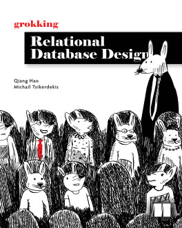

# Grokking Relational Database Design

**A friendly illustrated guide to designing and implementing your first database.**

A well-constructed database is easy to understand, query, manage, and scale when your app needs to grow. In Grokking Relational Database Design you'll learn the basics of relational database design including how to name fields and tables, which data to store where, how to eliminate repetition, good practices for data collection and hygiene, and much more. You won't need a computer science degree or in-depth knowledge of programming—the book's practical examples and down-to-earth definitions are beginner-friendly.

In [Grokking Relational Database Design](https://mng.bz/1J2q), you'll learn how to:

- Query and create databases using Structured Query Language (SQL)
- Design databases from scratch
- Implement and optimize database designs
- Take advantage of generative AI when designing databases

Interested? You can watch [one or two educational videos based on this book](https://www.youtube.com/playlist?list=PL3fg3zQpW0k4UO9eBDLdroADnB18ZAOgj), or [check out this book on Manning](https://mng.bz/1J2q) directly, and start reading now.

## Table of contents (for this code repo)

[This book](https://mng.bz/1J2q) is publised by Manning Publications. The print, ebook, and audio versions are available on both [Manning Publications](https://mng.bz/1J2q) and [Amazon](https://www.amazon.com/Grokking-Relational-Database-Design-Qiang/dp/1633437418). There are 8 chapters in this book. The table of contents is as follows:

- Chapter 1 - Introduction to Database and SQL ([code](./chapter_01/))
- Chapter 2 - Related Tables and More SQL ([code](./chapter_02/))
- Chapter 3 - Overview of Database Design (*No code*)
- Chapter 4 - Entities and Attributes ([code](./chapter_04/))
- Chapter 5 - Relationships ([code](./chapter_05/))
- Chapter 6 - Normalization and Implementation ([code](./chapter_06/))
- Chapter 7 - Security and Optimization  ([code](./chapter_07/))
- Chapter 8 - Database Design in the Age of Generative AI ([code](./chapter_08/))

## Authors

[Qiang Hao](https://www.youtube.com/@structuredcs) ([@structuredcs](https://www.youtube.com/@structuredcs)) and [Michail Tsikerdekis](https://michael.tsikerdekis.com) ([@tsikerdekis](https://github.com/tsikerdekis))
