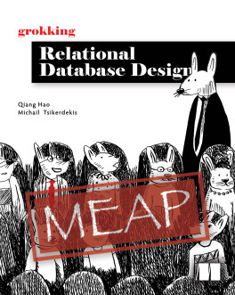

# Grokking Relational Database Design

**A friendly illustrated guide to designing and implementing your first database.**

A well-constructed database is easy to understand, query, manage, and scale when your app needs to grow. In Grokking Relational Database Design you’ll learn the basics of relational database design including how to name fields and tables, which data to store where, how to eliminate repetition, good practices for data collection and hygiene, and much more. You won’t need a computer science degree or in-depth knowledge of programming—the book’s practical examples and down-to-earth definitions are beginner-friendly.

In [Grokking Relational Database Design](http://mng.bz/1J2q), you’ll learn how to:

- Query and create databases using Structured Query Language (SQL)
- Design databases from scratch
- Implement and optimize database designs
- Take advantage of generative AI when designing databases

## Table of contents (for this code repo)

[This book](http://mng.bz/1J2q) is currently in the Manning Early Access Program (MEAP). Via MEAP, you can read chapters as they are written, and get the finished version as soon as it’s ready, and receive the print book long before it's in bookstores.

There are currently 8 chapters planned for this book. The following table of contents lists the chapters that are currently available in the MEAP, and the chapters that are planned for the final book.

- Chapter 1 - Introduction to Database and SQL ([code](./chapter_01/))
- Chapter 2 - Related Tables and More SQL ([code](./chapter_02/))
- Chapter 3 - Overview of Database Design (*No code*)
- Chapter 4 - Entities and Attributes ([code](./chapter_04/))
- Chapter 5 - Relationships ([code](./chapter_05/))
- Chapter 6 - Normalization ([code](./chapter_06/))
- Chapter 7 - Optimization  ([code](./chapter_07/))
- Chapter 8 - Database Design in the Age of Generative AI ([code](./chapter_08/))

Interested? You can [check out this book on Manning](http://mng.bz/1J2q) directly, and start reading now.

## Authors
[Qiang Hao](https://qhao.info/) ([@Neo-Hao](https://github.com/Neo-Hao)) and [Michail Tsikerdekis](http://michael.tsikerdekis.com) ([@tsikerdekis](https://github.com/tsikerdekis))
