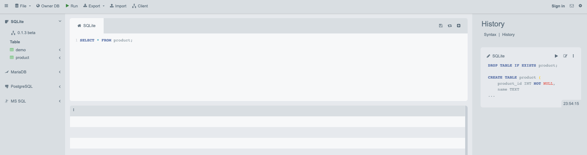

# Related tables and more SQL

The SQL code snippets covered in this chapter are all contained in this folder. The SQL code snippets covered in this chapter work perfectly with MySQL, MariaDB, and SQLite.

If you are using PostgreSQL, you should refer to the SQL script contained in this folder and pay attention to the following differences that were made to make the script compatible with PostgreSQL:

* `TIMESTAMP` was used instead of `DATETIME`: PostgreSQL doesn't support `DATETIME` data type.

If you are using SQL Server, you should refer to the SQL script contained in this folder and pay attention to the following differences that were made to make the script compatible with SQL Server:

* `NVARCHAR(MAX)` was used instead of `TEXT`: SQL Server doesn't support `TEXT` data type.
* Data insertion of string values was changed from `'...'` to `N'...'`: SQL Server requires the `N` prefix for string values, e.g., `N'Apple'`. SQL Server uses the UCS-2 encoding for string values, which is a subset of UTF-16. The `N` prefix tells SQL Server to use UTF-16 encoding for the string value.
* `GETDATE()` was used instead of `CURRENT_TIMESTAMP`: SQL Server doesn't support `CURRENT_TIMESTAMP` function.

If you are using SQLite database, you should refer to the SQL script contained in this folder and pay attention to the following differences that were made to make the script compatible with SQLite database:

* `TEXT` was used instead of `VARCHAR`: `VARCHAR` is the same as `TEXT` and has no length limit in SQLite.
* `TEXT` was used instead of `DECIMAL`: SQLite doesn't support `DECIMAL` data type. `REAL` is typically used instead of `DECIMAL` in SQLite when precision doesn't matter. When precision matters, `TEXT` is typically used in practice instead of `DECIMAL` in SQLite.
* `TEXT` was used instead of `DATETIME`: SQLite doesn't support `DATETIME` data type. `TEXT` is typically used instead of `DATETIME` in SQLite.

<!-- If you are using Oracle database, you should refer to the SQL script contained in this folder and pay attention to the following differences that were made to make the script compatible with Oracle database:

* `VARCHAR2` was used instead of `TEXT`: Oracle database doesn't support `TEXT` data type.
* `NUMBER` was used instead of `INT` and `DECIMAL`: Oracle database doesn't support `INT` or `DECIMAL` data types. -->

How to load the prepared scripts using different RDBMS and tools are covered in the following subsections.

- [SQLite online](#sqlite-online)
- [SQLite database](#sqlite-database)
    - [Load the prepared SQLite script](#load-the-prepared-sqlite-script)
- [MySQL database](#mysql-database)
    - [Load the prepared MySQL script](#load-the-prepared-mysql-script)
- [PostgreSQL database](#postgresql-database)
    - [Load the prepared PostgreSQL script](#load-the-prepared-postgresql-script)
- [SQL Server database](#sql-server-database)
    - [Load the prepared SQL Server script](#load-the-prepared-sql-server-script)
- [Oracle database](#oracle-database)
    - [Load the prepared Oracle script](#load-the-prepared-oracle-script)

## SQLite online

SQLite online is a web-based tool that you can use to execute SQL queries. You can access it at [SQLite online](https://sqliteonline.com/).

The script prepared for SQLite online is [`sqlite_online.sql`](./sqlite_online.sql). You can load the prepared script by:

1. Navigate to SQLite Online (https://sqliteonline.com)
2. Click _Import_ and load `sqlite_online.sql`
3. Click _Okay_

Now you should see the script executed in the right sidebar. You are ready to type into the console, follow the book, and execute SQL queries.



## SQLite database

In case you jump to this chapter directly, you need to refer to [the README file](../chapter_01/README.md/#sqlite-database) in the `chapter_01` folder to install SQLite first.

### Load the prepared SQLite script

The script prepared for SQLite database is [`sqlite_db.sql`](./sqlite_db.sql). You can load the prepared script by:

1. Open the terminal, navigate into the `chapter_02` folder of this repository
2. **** Run the following command, and you will be in the SQLite console environment:

```
sqlite3 onlinestore_chapter2.db
```

3. In the same SQLite console environment (e.g., the line prompt starts with `sqlite>`), run the following command to load the script:

```
.read sqlite_db.sql
```

4. In the same SQLite console environment, check if the table is created by running the following command:

```
.tables
```

If you see `products` and `review`, that means the script is loaded successfully. In the same SQLite console environment, you can run any SQL queries you want, including the examples covered by Chapter 2. You can always quit the SQLite console by typing `.quit` and pressing `Enter`.

## MySQL database

In case you jump to this chapter directly, you need to refer to [the README file](../chapter_01/README.md/#mysql-database) in the `chapter_01` folder to install MySQL first.

### Load the prepared MySQL script

The script prepared for MySQL database is [`mysql_db.sql`](./mysql_db.sql). You can load the prepared script by:

1. Open the terminal, navigate into the `chapter_02` folder of this repository
2. Run the following command:

```
    mysql -u root < mysql_db.sql
```

If you have set up a password for your MySQL server, you can run the following command instead:

```
    mysql -u root -p < mysql_db.sql
```

After that, you will be prompted to enter your password. 

Now you have loaded the script. To query the database and table created by the script, you will need to navigate to the MySQL console environment. You can do this by running the following command:

```
mysql -u root
```

In the MySQL console environment, you can run any SQL queries you want, including the examples covered by Chapter 2. You can always quit the MySQL console by typing `quit` and pressing `Enter`.

## PostgreSQL database

In case you jump to this chapter directly, you need to refer to [the README file](../chapter_01/README.md/#postgresql-database) in the `chapter_01` folder to install PostgreSQL first.

### Load the prepared PostgreSQL script

Before loading the script, you will need to create a database named `onlinestore_chapter2` and use this database via the PostgreSQL console environment first. Different from SQLite and MySQL, there are no easy approach to merge these two steps into the script. 

You can follow the following steps to load the prepared script:

1. Open the terminal, and navigate into the `chapter_02` folder of this repository

2. Log in to the PostgreSQL console environment by running the following command:

```
psql -U postgres
```
3. In the console environment, create a database named `onlinestore_chapter2` by running the following command:

```
CREATE DATABASE onlinestore_chapter2;
```

4. In the console environment, use the database `onlinestore_chapter2` by running the following command:

```
\c onlinestore_chapter2
```

5. Now you are ready to load the prepared script. The script prepared for PostgreSQL database is [`postgresql_db.sql`](./postgresql_db.sql). In the console environment, run the following command:

```
\i postgresql_db.sql
```

In the same console environment, you can run any SQL queries you want, including the examples covered by Chapter 2. You can always quit the PostgreSQL console by typing `\q` and pressing `Enter`.

## SQL Server database

In case you jump to this chapter directly, you need to refer to [the README file](../chapter_01/README.md/#sql-server) in the `chapter_01` folder to install SQL Server first.

### Load the prepared SQL Server script

The script prepared for SQL Server database is [`sql_server_db.sql`](./sql_server_db.sql). You can refer to [the same instructions for Chapter 1](../chapter_01/README.md#load-the-prepared-sql-server-script) to load the script. Please remember that you should load the script from the folder of `chapter_02` instead of `chapter_01`.

## Oracle database

In case you jump to this chapter directly, you need to refer to [the README file](../chapter_01/README.md/#oracle-database) in the `chapter_01` folder to install Oracle first.

### Load the prepared Oracle script

The script prepared for Oracle is [`sql_server_db.sql`](./oracle_db.sql). You can refer to [the same instructions for Chapter 1](../chapter_01/README.md#load-the-prepared-oracle-script) to load the script. Please remember that you should load the script from the folder of `chapter_02` instead of `chapter_01`.