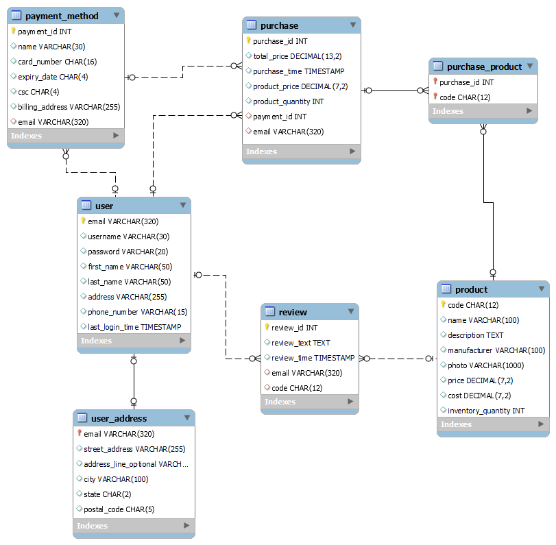

# Relationships

Practioners use tools such as dbdiagram.io or MySQL Workbench to create and edit E-R diagrams. The reason for such choices is that these tools allow you to generate SQL CREATE TABLE statements based on the visualized E-R diagram.

The corresponding chapter in this book developed the entities and their attributes for the database of The Sci-fi Collective. You can find the developed entities and their relationships, as well as how to load them using dbdiagram.io or MySQL Workbench.

- [View or edit the E-R diagram via dbdiagram](#view-or-edit-the-e-r-diagram-via-dbdiagram)
- [View or edit the E-R diagram via MySQL Workbench](#view-or-edit-the-e-r-diagram-via-mysql-workbench)
- [Scripts for different RDBMS](#scripts-for-different-rdbms)

The final state of entities as described in Chapter 5 is as follows:

## View or edit the E-R diagram via dbdiagram

[dbdiagram.io](https://dbdiagram.io) is a free online service that allows you to create and edit E-R diagrams. You can also generate SQL CREATE TABLE statements given a diagram using dbdiagram.io. The current file contains all entities as described in their final state in Chapter 5. To view or edit the E-R diagram via diagram.io, you can use the following steps:

1. Visit the [dbdiagram.io](https://dbdiagram.io/home) website, and log into your account.
2. Click on the "Import Database" button on the left side of the page.
3. Click on the "Upload a file" button.
4. Select the file `mysql_db.sql` and click "Open".
5. Click on the "Import" button.
6. You can now view the current E-R diagram. Changes can be made to the left. You can use "Export" to generate a new SQL file.

You can refer to [the manual of diagram.io](https://dbdiagram.io/docs/) if you have any questions about diagram.io.

## View or edit the E-R diagram via MySQL Workbench

MySQL Workbench is an administration tool for MySQL as much as an E-R diagramming software. There are extensive tutorials for using the software but specifically for Database Design, you can use this part of the manual as a reference: [Database Design and Modeling](https://dev.mysql.com/doc/workbench/en/wb-data-modeling.html)

### Windows

1. Visit the [MySQL Workbench Download Page](https://dev.mysql.com/downloads/workbench/).
2. Download the `mysql-workbench-community-8.0.33-winx64.msi` file from "Other Downloads" section. The Download button is to the right. Make sure to download this file since if you download the MySQL Installer it will also install MySQL on your system (which we assume you already have installed from previous chapters and do not need to on this one).
3. Follow the installation instructions from the installer.
4. Once installed, double-click on the file or use File -> Open Model ... from within MySQL Workbench.
5. The file (`er-diagram.mwb`) is a MySQL Workbench Document that allows you to edit entity relationship diagrams and generate SQL CREATE TABLE statements based on these diagrams. The current file contains all entities as described in their final state in Chapter 5.
6. Once you see the entities you can freely double-click and evaluate them as well as make any necessary changes.

### Linux

1. Visit the [MySQL Workbench Download Page](https://dev.mysql.com/downloads/workbench/).
2. Download the `mysql-workbench-community-8.0.33-1.el8.x86_64.rpm` file from "Other Downloads" section. The Download button is to the right. Make sure to download this file since if you download the MySQL Installer it will also install MySQL on your system (which we assume you already have installed from previous chapters and do not need to on this one).
3. Follow the installation instructions from the installer.
4. Once installed, double-click on the file or use File -> Open Model ... from within MySQL Workbench.
5. The file (`er-diagram.mwb`) is a MySQL Workbench Document that allows you to edit entity relationship diagrams and generate SQL CREATE TABLE statements based on these diagrams. The current file contains all entities as described in their final state in Chapter 5.
6. Once you see the entities you can freely double-click and evaluate them as well as make any necessary changes.

### Mac

1. Visit the [MySQL Workbench Download Page](https://dev.mysql.com/downloads/workbench/).
2. Download the `mysql-workbench-community-8.0.33-macos-x86_64.dmg` file from "Other Downloads" section. The Download button is to the right. Make sure to download this file since if you download the MySQL Installer it will also install MySQL on your system (which we assume you already have installed from previous chapters).
3. Follow the installation instructions from the installer.
4. Once installed, double-click on the file or use File -> Open Model ... from within MySQL Workbench.
5. The file (`er-diagram.mwb`) is a MySQL Workbench Document that allows you to edit entity relationship diagrams and generate SQL CREATE TABLE statements based on these diagrams. The current file contains all entities as described in their final state in Chapter 5.
6. Once you see the entities you can freely double-click and evaluate them as well as make any necessary changes.

## Scripts for different RDBMS 

We have provided scripts for different RDBMS that correspond to the final state of the entities and relationships in Chapter 5. You can find these scripts as follows:

- [MySQL](./mysql_db.sql)
- [PostgreSQL](./postgresql_db.sql)
- [SQLite](./sqlite_db.sql)
- [SQL Server](./sqlserver_db.sql)
- [Oracle](./oracle_db.sql)

You can refer to [the README files in the folder of Chapter 1](../chapter_01/README.md) for instructions on how to load these scripts into the corresponding RDBMS.