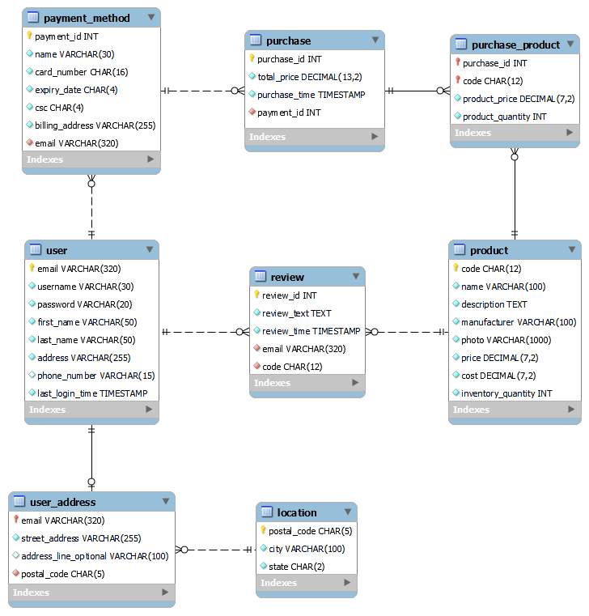
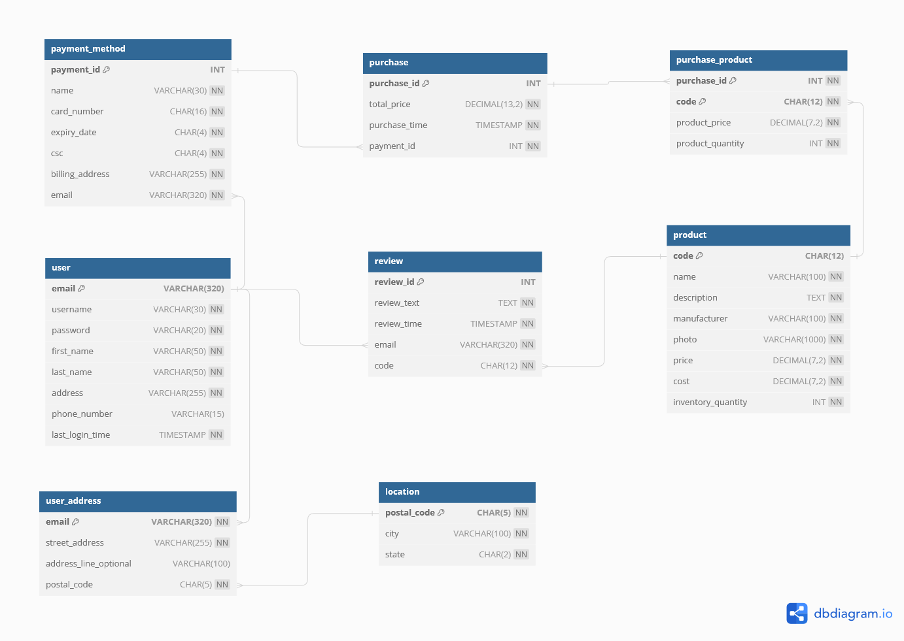

# Normalization and Implementation

Practioners use tools such as dbdiagram.io, LucidChart, or MySQL Workbench to create and edit E-R diagrams.

The corresponding chapter in this book developed the entities and their attributes for the database of The Sci-fi Collective. You can find the developed entities and their relationships, as well as how to load (or check) them using corresponding tools.

- [View or edit the E-R diagram via dbdiagram](#view-or-edit-the-e-r-diagram-via-dbdiagram)
- [View or edit the E-R diagram via MySQL Workbench](#view-or-edit-the-e-r-diagram-via-mysql-workbench)

The final state of entities as described in Chapter 6 is as follows:

## View or edit the E-R diagram via dbdiagram

[dbdiagram.io](https://dbdiagram.io) is a free online tool for drawing E-R Diagrams by writing code. You can also generate `SQL CREATE TABLE` statements given a diagram using dbdiagram.io. dbdiagram.io supports three RDBMS: MySQL, PostgreSQL, and SQL Server.

What we achieved in this chapter is not the end of the E-R diagram that we aim to develop. As a result, we only provide a MySQL script (`dbdiagram.sql`) that correspond to the final state of entities and relationships of this chapter. 

When you import the provided script into dbdiagram.io, you will be able to view or edit the corresponding E-R diagram. You can also generate a new SQL script for PostgreSQL or SQL server from the diagram. To import the script, please follow the steps below:

1. Visit the [dbdiagram.io](https://dbdiagram.io/home) website, and log into your account.
2. Click on the "Import Database" button in the top navigation bar.
3. You can either copy and paste the content of the `dbdiagram.sql` file into the text area or click on the "Upload .sql" button to upload the `dbdiagram.sql` file.
4. When you are done, click on the "Submit" button.

You can refer to [the manual of diagram.io](https://dbdiagram.io/docs/) if you have any questions about diagram.io.

## View or edit the E-R diagram via MySQL Workbench

MySQL Workbench is an administration tool for MySQL as much as an E-R diagramming software. Different from dbdiagram.io, MySQL Workbench is a desktop application that you need to install on your computer. Additionally, MySQL only supports MySQL as the RDBMS. However, you can use use MySQL Workbench to generate a MySQL script first, and then convert it to scripts for other RSBMS using SQL converter tools such as [SQLines](https://sqlines.com/online).

There are extensive tutorials for how to use MySQL Workbench for Database Design, you can use this part of the manual as a reference: [Database Design and Modeling](https://dev.mysql.com/doc/workbench/en/wb-data-modeling.html). MySQL Workbench is available for Windows, Linux, and Mac. 

### Windows

1. Visit the [MySQL Workbench Download Page](https://dev.mysql.com/downloads/workbench/).
2. Download the `mysql-workbench-community-8.0.33-winx64.msi` file from "Other Downloads" section. The Download button is to the right. Make sure to download this file since if you download the MySQL Installer it will also install MySQL on your system (which we assume you already have installed from previous chapters and do not need to on this one).
3. Follow the installation instructions from the installer.
4. Once installed, double-click on the file or use File -> Open Model ... from within MySQL Workbench.
5. The file (`workbench.mwb`) is a MySQL Workbench Document that allows you to edit entity relationship diagrams and generate SQL CREATE TABLE statements based on these diagrams. The current file contains all entities as described in their final state in Chapter 6.
6. Once you see the entities you can freely double-click and evaluate them as well as make any necessary changes.

### Linux

1. Visit the [MySQL Workbench Download Page](https://dev.mysql.com/downloads/workbench/).
2. Download the `mysql-workbench-community-8.0.33-1.el8.x86_64.rpm` file from "Other Downloads" section. The Download button is to the right. Make sure to download this file since if you download the MySQL Installer it will also install MySQL on your system (which we assume you already have installed from previous chapters and do not need to on this one).
3. Follow the installation instructions from the installer.
4. Once installed, double-click on the file or use File -> Open Model ... from within MySQL Workbench.
5. The file (`workbench.mwb`) is a MySQL Workbench Document that allows you to edit entity relationship diagrams and generate SQL CREATE TABLE statements based on these diagrams. The current file contains all entities as described in their final state in Chapter 6.
6. Once you see the entities you can freely double-click and evaluate them as well as make any necessary changes.

### Mac

1. Visit the [MySQL Workbench Download Page](https://dev.mysql.com/downloads/workbench/).
2. Download the `mysql-workbench-community-8.0.33-macos-x86_64.dmg` file from "Other Downloads" section. The Download button is to the right. Make sure to download this file since if you download the MySQL Installer it will also install MySQL on your system (which we assume you already have installed from previous chapters).
3. Follow the installation instructions from the installer.
4. Once installed, double-click on the file or use File -> Open Model ... from within MySQL Workbench.
5. The file (`workbench.mwb`) is a MySQL Workbench Document that allows you to edit entity relationship diagrams and generate SQL CREATE TABLE statements based on these diagrams. The current file contains all entities as described in their final state in Chapter 6.
6. Once you see the entities you can freely double-click and evaluate them as well as make any necessary changes.

## Modifications for different RDBMS

You will need to make some modifications to the attributes for different RDBMS. Considering that this chapter is not the end of the E-R diagram that we are still developing, we won't provide different versions of the E-R diagram tailored to different RDBMS. Instead, we will only describe the necessary modifications for SQL Server, SQLite and Oracle below for your reference.

### MySQL and MariaDB

The entities and attributes depicted in the E-R diagram don't require any modifications for MySQL and MariaDB.

### PostgreSQL

`user` is a reserved keyword in PostgreSQL. You can't use it as a table name. You can use `system_user` instead of `user`.

### SQL Server

The following changes need to be made for SQL Server:

**`TIMESTAMP` to `DATETIMEOFFSET`**:  SQL Server uses DATETIMEOFFSET instead of TIMESTAMP. DATETIMEOFFSET stores the date, time, and offset from UTC. DATETIMEOFFSET is a SQL Server-specific data type that is not part of the ANSI SQL standard. DATETIMEOFFSET is used when you need to store the time zone offset of a particular date and time value.

**`VARCHAR` to `NVARCHAR`**: It is recommended to use `NVARCHAR` instead of `VARCHAR` for SQL Server. `VARCHAR` is used for non-Unicode character data. It stores ASCII characters and can represent a limited set of characters (specifically those in the code page of your server's collation setting). `NVARCHAR` is used for Unicode character data -- It can store characters from multiple languages and alphabets and uses two bytes per character.If your application needs to support multiple languages or special characters that are not represented in the default character set, then you should use `NVARCHAR`.

**`TEXT` to `NVARCHAR(MAX)`**: `TEXT` is a deprecated data type in SQL Server. It is recommended to use `NVARCHAR(MAX)` instead of `TEXT`. `NVARCHAR(MAX)` is used for Unicode character data of variable length. `NVARCHAR(MAX)` can store up to 2GB of data. `NVARCHAR(MAX)` is a SQL Server-specific data type that is not part of the ANSI SQL standard. `NVARCHAR(MAX)` is used when you need to store large amounts of Unicode character data (more than 4000 characters).

**`AUTO_INCREMENT` to `IDENTITY`**: `IDENTITY` the name used for `AUTO_INCREMENT` in SQL Server. The effect is the same.

**`CURRENT_TIMESTAMP` to `GETDATE()`**: The function name is different but the use is exactly the same.

**`VISIBLE` is  not necessary**: It is the default for SQL server so it is ommitted from the create table statement.

### SQLite

The following changes need to be made for SQLite:

**`TIMESTAMP` to `TEXT`**: SQLite doesn't support the `TIMESTAMP` data type. It is recommended to use `TEXT` instead of `TIMESTAMP` for SQLite.

**`CHAR` and `VARCHAR` to `TEXT`**: `CHAR` and `VARCHAR` are the same as `TEXT` in SQLite, and all of which have no length limit in SQLite.

**`DECIMAL` to `INT` or `TEXT`**: SQLite doesn't support `DECIMAL` data type. `REAL` is typically used instead of `DECIMAL` in SQLite when precision doesn't matter. When precision matters, `INT` or `TEXT` are typically used in practice for decimal numbers.

**Character encodings not supported**: SQLite uses UTF-8 by default.

**`AUTO_INCREMENT` to `INTEGER PRIMARY KEY`**: As long as a column is a primary key and integer the auto-incrementing effect is automatic.

**`VISIBLE` is  not necessary**: It is the default for SQLite so it is ommitted from the create table statement.

**`CURRENT_TIMESTAMP` to `datetime('now')`**: Use is exactly the same just the syntax is different.