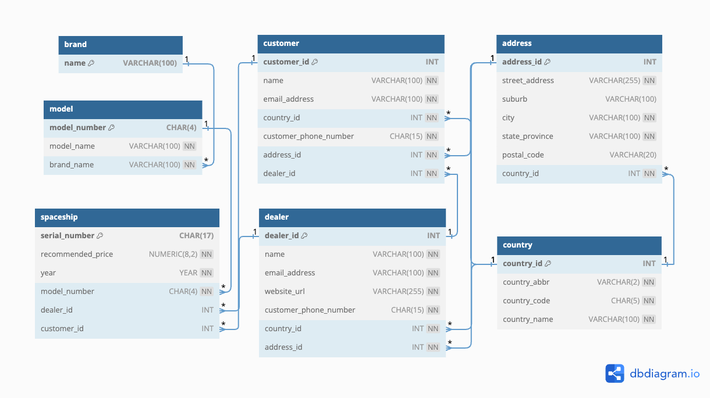
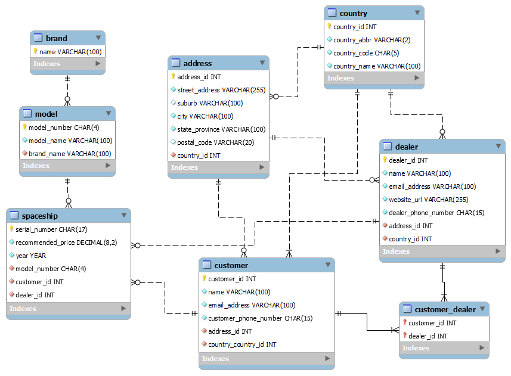

# Database Design in the Age of Generative AI

Practioners use tools such as dbdiagram.io, LucidChart, or MySQL Workbench to create and edit E-R diagrams.

The corresponding chapter in this book developed the entities and their attributes for the database of The Sci-fi Collective. You can find the developed entities and their relationships, as well as how to load (or check) them using corresponding tools.

- [View or edit the E-R diagram via dbdiagram](#view-or-edit-the-e-r-diagram-via-dbdiagram)
- [View or edit the E-R diagram via MySQL Workbench](#view-or-edit-the-e-r-diagram-via-mysql-workbench)

The final state of entities as described in Chapter 8 is as follows:

<!--  -->

The questions/requests used to generate ChatGPT responses can be found in <a href="./chatgpt_request.md">chatgpt_requests.md</a>.

## View or edit the E-R diagram via dbdiagram

[dbdiagram.io](https://dbdiagram.io) is a free online tool for drawing E-R Diagrams by writing code. You can also generate `SQL CREATE TABLE` statements given a diagram using dbdiagram.io. dbdiagram.io supports three RDBMS: MySQL, PostgreSQL, and SQL Server.

What we achieved in this chapter is not the end of the E-R diagram that we aim to develop. As a result, we only provide a MySQL script (`dbdiagram.sql`) that correspond to the final state of entities and relationships of this chapter. 

When you import the provided script into dbdiagram.io, you will be able to view or edit the corresponding E-R diagram. You can also generate a new SQL script for PostgreSQL or SQL server from the diagram. To import the script, please follow the steps below:

1. Visit the [dbdiagram.io](https://dbdiagram.io/home) website, and log into your account.
2. Click on the "Import Database" button in the top navigation bar.
3. You can either copy and paste the content of the `dbdiagram.sql` file into the text area or click on the "Upload .sql" button to upload the `dbdiagram.sql` file.
4. When you are done, click on the "Submit" button.

You can refer to [the manual of diagram.io](https://dbdiagram.io/docs/) if you have any questions about diagram.io.

## View or edit the E-R diagram via MySQL Workbench

MySQL Workbench is an administration tool for MySQL as much as an E-R diagramming software. Different from dbdiagram.io, MySQL Workbench is a desktop application that you need to install on your computer. Additionally, MySQL only supports MySQL as the RDBMS. However, you can use use MySQL Workbench to generate a MySQL script first, and then convert it to scripts for other RSBMS using SQL converter tools such as [SQLines](https://sqlines.com/online).

There are extensive tutorials for how to use MySQL Workbench for Database Design, you can use this part of the manual as a reference: [Database Design and Modeling](https://dev.mysql.com/doc/workbench/en/wb-data-modeling.html). MySQL Workbench is available for Windows, Linux, and Mac. 

### Windows

1. Visit the [MySQL Workbench Download Page](https://dev.mysql.com/downloads/workbench/).
2. Download the `mysql-workbench-community-8.0.33-winx64.msi` file from "Other Downloads" section. The Download button is to the right. Make sure to download this file since if you download the MySQL Installer it will also install MySQL on your system (which we assume you already have installed from previous chapters and do not need to on this one).
3. Follow the installation instructions from the installer.
4. Once installed, double-click on the file or use File -> Open Model ... from within MySQL Workbench.
5. The file (`workbench.mwb`) is a MySQL Workbench Document that allows you to edit entity relationship diagrams and generate SQL CREATE TABLE statements based on these diagrams. The current file contains all entities as described in their final state in Chapter 7.
6. Once you see the entities you can freely double-click and evaluate them as well as make any necessary changes.

### Linux

1. Visit the [MySQL Workbench Download Page](https://dev.mysql.com/downloads/workbench/).
2. Download the `mysql-workbench-community-8.0.33-1.el8.x86_64.rpm` file from "Other Downloads" section. The Download button is to the right. Make sure to download this file since if you download the MySQL Installer it will also install MySQL on your system (which we assume you already have installed from previous chapters and do not need to on this one).
3. Follow the installation instructions from the installer.
4. Once installed, double-click on the file or use File -> Open Model ... from within MySQL Workbench.
5. The file (`workbench.mwb`) is a MySQL Workbench Document that allows you to edit entity relationship diagrams and generate SQL CREATE TABLE statements based on these diagrams. The current file contains all entities as described in their final state in Chapter 7.
6. Once you see the entities you can freely double-click and evaluate them as well as make any necessary changes.

### Mac

1. Visit the [MySQL Workbench Download Page](https://dev.mysql.com/downloads/workbench/).
2. Download the `mysql-workbench-community-8.0.33-macos-x86_64.dmg` file from "Other Downloads" section. The Download button is to the right. Make sure to download this file since if you download the MySQL Installer it will also install MySQL on your system (which we assume you already have installed from previous chapters).
3. Follow the installation instructions from the installer.
4. Once installed, double-click on the file or use File -> Open Model ... from within MySQL Workbench.
5. The file (`workbench.mwb`) is a MySQL Workbench Document that allows you to edit entity relationship diagrams and generate SQL CREATE TABLE statements based on these diagrams. The current file contains all entities as described in their final state in Chapter 7.
6. Once you see the entities you can freely double-click and evaluate them as well as make any necessary changes. 

## Modifications to attributes for different RDBMS

You will need to make some modifications to the attributes for different RDBMS. Considering that this chapter is not the end of the E-R diagram that we are still developing, we won't provide different versions of the E-R diagram tailored to different RDBMS. Instead, we will only describe the necessary modifications for SQL Server, SQLite and Oracle below for your reference.

### MySQL, MariaDB, and PostgreSQL

The entities and attributes depicted in the E-R diagram don't require any modifications for MySQL and MariaDB.

### PostgreSQL

The following changes need to be made for PostgreSQL:

**Replace `INT AUTO_INCREMENT` with `SERIAL`**: PostgreSQL uses `SERIAL` for auto-incrementing integer columns.

**Change `YEAR` to `SMALLINT`**: PostgreSQL doesn't have a specific `YEAR` type. `SMALLINT` is typically used for year values.

**Consider using `TEXT` instead of `VARCHAR`**: While PostgreSQL supports `VARCHAR`, `TEXT` is often preferred as it has no length limit.

**Replace `NUMERIC` with `DECIMAL`**: PostgreSQL supports both `NUMERIC` and `DECIMAL` as synonyms, but `DECIMAL` is more commonly used.

**Adjust `CHECK` constraints**: The syntax is slightly different in PostgreSQL, but the concept remains the same.

**Modify foreign key constraint syntax**: While the concept is the same, the syntax for defining foreign key constraints might need slight adjustments for PostgreSQL.

### SQL Server

The following changes need to be made for SQL Server:

**Change `INT AUTO_INCREMENT` to `INT IDENTITY(1,1)`**: SQL Server uses `IDENTITY(1,1)` for auto-incrementing columns.

**Change `VARCHAR` to `NVARCHAR`**: While `VARCHAR` exists in SQL Server, `NVARCHAR` is generally preferred for better Unicode support.

**Change `CHAR` to `NCHAR`**: For fixed-length character fields, use `NCHAR` in SQL Server for Unicode support.

**Change `NUMERIC` to `DECIMAL`**: While SQL Server supports both `NUMERIC` and `DECIMAL`, `DECIMAL` is more commonly used.

**Change `YEAR` to `SMALLINT`**: SQL Server doesn't have a specific `YEAR` type. `SMALLINT` is typically used for year values.

**Adjust `CHECK` constraints**: The syntax is slightly different in SQL Server, but the concept remains the same.

**Modify foreign key constraint syntax**: While the concept is the same, the syntax for defining foreign key constraints is slightly different in SQL Server.

### SQLite

The following changes need to be made for SQLite:

**Character encodings not supported**: SQLite uses UTF-8 by default.

**Remove `AUTO_INCREMENT`**: SQLite doesn't support `AUTO_INCREMENT`. Instead, you can use `INTEGER PRIMARY KEY` which will auto-increment automatically.

**Change `INT` to `INTEGER`**: While SQLite will usually accept `INT`, it's best practice to use `INTEGER`.

**Change `CHAR` to `TEXT`**: SQLite doesn't have a `CHAR` type. Use `TEXT` instead.

**Change `VARCHAR` to `TEXT`**: SQLite doesn't have a `VARCHAR` type. Use `TEXT` instead.

**Change `NUMERIC` to `REAL`**: For floating-point numbers, use `REAL` in SQLite.

**Remove `YEAR` type**: SQLite doesn't have a specific `YEAR` type. Use `INTEGER` instead.

**Remove size specifications**: SQLite doesn't use size specifications for text fields (e.g., `VARCHAR(100)` becomes just `TEXT`).

**Adjust `CHECK` constraints**: The syntax is slightly different in SQLite. You'll need to wrap the condition in parentheses.

**Adjust foreign key constraints**: SQLite supports foreign key constraints, but the syntax is slightly different and you need to enable foreign key support explicitly.